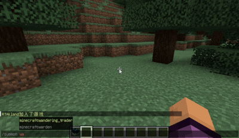

# CarryEntity

> 这个插件是可以将一个生物搬起来，安装Shift + 右键一个生物即可将其搬起来，搬起来后按下Shift即可将其放下

# 展示

# 使用

使用`/carryentity enable/disable` 可以调整自己的开关

> 目前只有1.21.1以上的版本能用哦, 如果想使用低版本的话可以联系我+10元我会给出低版本的兼容版

# 购买

插件定价为15元， 通过邮件： me@rtast.cn 或 QQ: 3458671395联系我