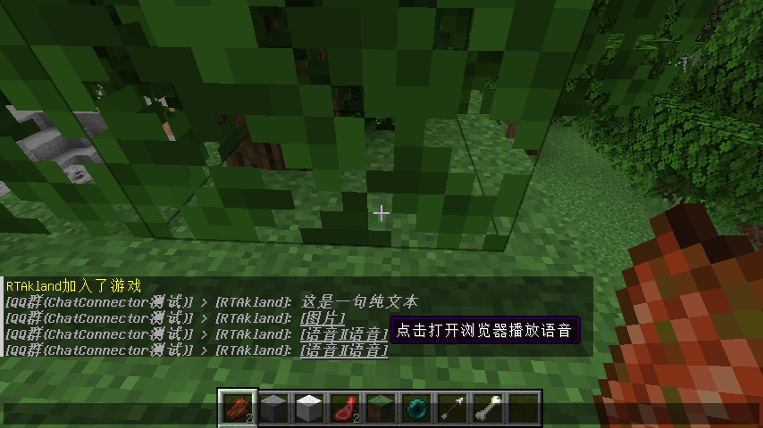
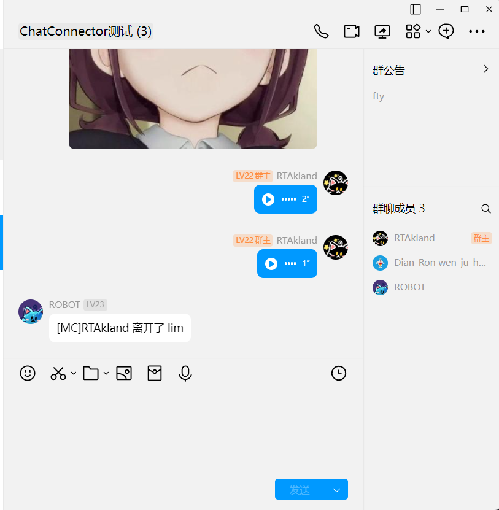

<div align="center">


<h2>ChatConnector</h2>

<h3>⭐一个可以互通QQMC消息以及子服消息同步的Velocity插件⭐</h3>


</div>

# 概述

这个插件可以互通QQ和MC的消息, 包括不限于纯文本、同步子服之间的消息(跨服聊天)、远程执行命令
快速添加白名单, 解析消息段并转换成游戏内支持的文本格式(可以点击消息、悬浮文本预览内容), 并且支持将其他子服的玩家显示到玩家列表中

如果你需要任何帮助你可以加入ChatConnector交流群(575300987), 有任何问题都可以在这里面问, 前提是你读完并且了解了本文档。
我会在这个群内测试我的插件

# 展示

<div style="display: flex;">
    
    
</div>


# 使用

!> v3.x已经弃用了Discord/Kook的支持

> 这里不赘述配置OneBot11的实现, 只需要找到一个支持正向Websocket的OneBot11实现  
> 这里给出几个可以用的实现: `Lagrange.OneBot` `Napcat` `LlOneBot`

***注意: 除了Lagrange.OneBot其余都没有测试过, 请自行测试可用性***

## 已支持解析的消息类型

|      功能/平台      | MC向QQ | QQ向MC |
|:---------------:|:-----:|:-----:|
|       纯文本       |   ✅   |   ✅   |
|      通用CQ码      |   ✅   |       |
|       图片        |       |   ✅   | 
|       语音        |       |   ✅   |  
|       艾特        |       |   ✅   |
|      消息链转发      |       |   ✅   |
|       位置        |       |   ✅   |
|       收藏        |       |   ✅   |
|      好友推荐       |       |   ✅   |
|      群聊推荐       |       |   ✅   |
|       文档        |       |   ✅   |
|      音乐分享       |       |   ✅   |
|      班级作业       |       |   ✅   |
|   视频分享(哔哩哔哩)    |       |   ✅   |
|       骰子        |       |   ✅   |
|      石头剪刀布      |       |   ✅   |
|    群公告(不含图片)    |       |   ✅   |
| MiniMessage语法消息 |       |   ✅   |

## 支持的功能

1. 支持在Tab列表中显示出其他子服的玩家名，并且将其他子服的玩家名字设置成灰色
2. 跨服聊天 - 其他子服发的消息可以广播到全部子服
3. 群服互通， 将QQ群和MC的消息相互转发, 也可以设置游戏内转发的前缀, 必须以某个前缀开头的消息才会被转发到QQ群, 默认为任何消息都转发
4. QQ群内执行MC的命令
5. 操作白名单
6. 多QQ群转发 - 多个QQ群的消息转发到MC，MC的消息同样会被转发到所有在配置文件内的群中
7. 快速对一个从QQ群内转发来的消息进行回复就像下面这样  
   
8. 戳一戳机器人快速获取在线玩家列表
9. 映射服务器名称 - 将velocity的子服名称映射成中文转发到群内
10. 可选的屏蔽某个子服的聊天消息
11. 自定义消息转发模板

## 指令

### 游戏内指令

> 游戏内的指令都是/chatc开头的

可用的游戏内指令如下

1. /chatc reconnect - 重连Websocket和Rcon
2. /chatc reply - 回复一个消息
3. /chatc at - at一个群内的成员
4. /chatc check-message - 检查是否有新的广播消息

### 群内指令

> 群内的指令前缀可以为一下三种的任意一个

1. !!
2. ！！
3. /

> 意思就是如果一个命令是`help` 那么你可以在群内发送下面三种情况中的任意一种就能成功执行

1. !!help
2. ！！help
3. /help

可用的群内指令如下

1. !!at <玩家名>  在群内@游戏内的玩家(不论在哪个子服, 只要是通过Velocity连接到的玩家都能@), 被@的玩家会在屏幕上提示(
   但是没有声音, 因为这是Velocity的限制)
2. !!exec <rcon名字> <指令>  在群内对子服执行命令, 需要配置RCOn
3. !!help 帮助
4. !!list 列出在线玩家
5. !!reconnect 重连Websocket和RCON
6. !!status 获取服务器状态
7. !!wh <on | off | add | remove> [玩家名] 操作白名单

## 配置

```json5
{
   // 密钥
   "secretKey": "<your secret key here>",
   // 正向Websocket连接地址
   "wsAddress": "ws://127.0.0.1:8081/ws",
   // 正向ws的token
   "accessToken": "1145141919810",
   // 权限配置, owner和admins权限一样， others表示没权限， 可以不填
   "permission": {
      "owner": 3458671395,
      "admins": [
         114514,
         1919810
      ],
      "others": [
         66666,
         33343131
      ]
   },
   // 配置RCON
   "rcons": {
      // 是否启用RCON， 如果需要操作白名单的话就需要开启并正确配置
      "enabled": false,
      "rcons": [
         {
            // 名称必须唯一
            "name": "instance1",
            // rcon的主机名
            "host": "127.0.0.1",
            // rcon的端口号
            "port": 25577,
            // rcon的密码
            "password": "123456"
         },
         {
            "name": "instance2",
            "host": "127.0.0.1",
            "port": 25599,
            "password": "1919810"
         }
      ]
   },
   "style": {
      // 跨服聊天的消息样式， 遵循MiniMessage语法
      "crossServerMessageStyle": "<green>[{{serverName}}]</green> > [{{playerName}}]: {{message}}",
      // QQ群转发来的消息的样式， 遵循MiniMessage语法
      "groupMessageStyle": "<green>[QQ群({{groupName}})]</green> > [{{senderName}}]: {{message}}"
   },
   "mcForwardPrefix": "",
   // 这里是控制以什么前缀开头的消息会被转发到QQ群, 设置成空就是任何消息都会被转发到QQ群
   "enableTabList": true,
   // 是否开启在Tab列表显示其他子服的玩家
   "enableNicknameAsPlayerCount": true,
   // 是否在/list指令的返回中添加玩家的皮肤的头， 注意： 开启之后返回消息会变慢，如果人多不要开启
   "enableListCommandPlayerHeadDisplay": true,
   // 石头在戳一戳机器人返回的玩家列表中添加玩家的头， 注意： 开启之后返回消息会变慢，如果人多不要开启
   "enableDoubleTapPlayerHeadDisplay": false,
   // 设置子服的名称映射
   "subServerNameMap": {
      "lobby": "大厅"
   },
   // 设置忽略某个子服的聊天信息, 如果需要转发所有的子服的消息，请把lobby删除
   "ignoreChatServers": [
      "lobby"
   ],
   // 如果开启了使用机器人名字作为在线玩家数的情况下可以设置机器人名字的模板
   "botNicknameTemplate": "{{botName}} | 在线玩家数: {{onlinePlayerCount}}",
   // 表示是否开启跨服聊天
   "enableCrossServerChat": true,
   // 设置help命令返回的格式, 默认是以图片返回, 可以改成Text来将其改为纯文本
   "helpCommandResponseType": "Image",
   // 每个群组的设置, 可以有多个, 只需要复制粘贴一下就行
   "groupsSettings": {
      // 群号
      "114514": {
         // 表示需要上报的事件， 不需要哪个事件就删除掉哪一行
         "events": [
            // 玩家退出游戏
            "PlayerLeaveEvent",
            // 玩家加入游戏
            "PlayerJoinEvent",
            // 玩家聊天消息
            "PlayerChatEvent",
            // 从QQ群转发消息
            "GroupMessageEvent",
         ],
         // 设置群聊的消息以什么开头才会被转发进mc, 默认为全部消息都转发
         "groupForwardPrefix": "",
         // 设置每个命令在这个群的开关, 设置成false则表示这个群禁用这个命令
         "commandEnableStatus": {
            "help": true,
            "list": true,
            "exec": true,
            "status": true,
            "at": true,
            "wh": true,
            "rec": true
         },
         // 设置每个命令在这个群需要的权限
         "commandPermission": {
            "help": "Normal",
            "list": "Normal",
            "exec": "Admin",
            "status": "Normal",
            "at": "Normal",
            "wh": "Admin",
            "rec": "Admin"
         }
      }
   },
}
```
这是默认的配置文件, 你可以按需修改, 如果不知道怎么配置的话可以联系我帮忙配置

# 注

!> 售出不退！

!> 如果想要增加新的功能，可以联系我获取报价

!> 插件有密钥验证如果不加密钥直接启动的话会直接导致velocity退出！ 并且一个密钥只能有一个客户端同时在线

# 购买

!> 请通过[邮件](mailto:buy@rtast.cn)联系我并进行购买，我会尽可能快的回复您的消息 。 也可以直接通过QQ联系我 `3458671395`。
本插件定价暂时为 `20元(RMB)`。


> 如果你选择先付款而不是先沟通那我默认就认为你知道上面的售出不退, 付完款就加我QQ联系，然后告诉我你的
> 微信名字

